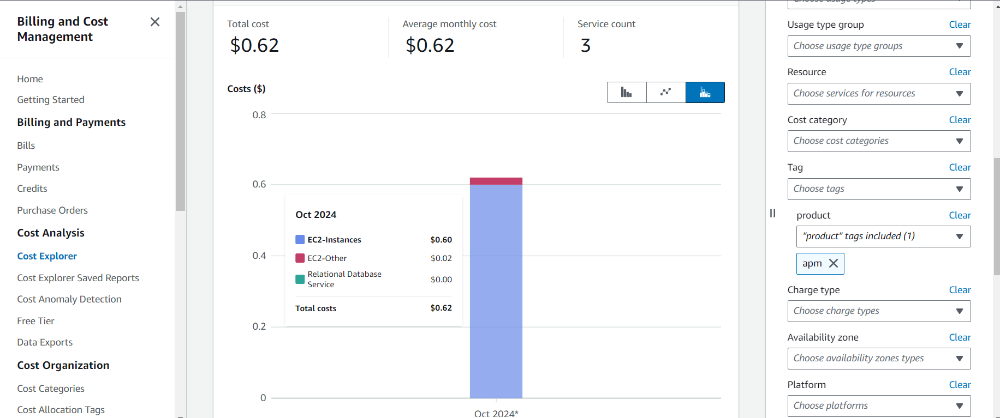

# AWS Cost Calculation

To track and simplify cost allocation:

- 1. **Use Cost Allocation Tags**: I tagged all AWS resources associated with each product (EKS nodes, RDS, ElastiCache, S3 directories, etc.) and from AWS Cost Explorer I filtered and generate cost reports based on these tags.

- Tag examples: `Product: apm` , `Product: bug`, `product: Shared`.
  Enable Detailed Billing Reports: In AWS Billing, I enabled      detailed billing reports and used Cost Explorer to track each product’s cost. These reports provide itemized usage and costs per tag.

  

- 2. **Shared Resources**:

 
  Shared RDS: $100/month total cost, and from grafana we get total no of connections =1000 connections 

  I think we can estimate the percentage of queries made by Product bug in the following ways:

- Using lsof to Count the number of active Connections from `Product bug` Pods  to the RDS shared instance and same for other shared resources such as elasticache redis instance 
 
 - Using SHOW PROCESSLIST in RDS shared instance to Count Active Queries from Product bug
  
   let assume after estimation 100 of queries are from bug product
   cost of bug % in shared RDS instance  = $100 * (100/1000) = $10

let assume:

Shared ElastiCache core-cache: $50/month total cost, 200 queries  from Product bug and from grafana total query or connections=1000.

cost of bug % in Shared ElastiCache cost = $50 * (200/1000) = $1

Shared S3: $10/month total cost, Product bug uses 50% of storage.
Shared S3 cost = $10 * 0.50 = $5

- 3. **Another approach in estimating the percentage of resources of each product in shared resources** 

 - using different database users for each product in shared RDS and ElastiCache instances is a very effective approach to estimate the percentage of resources used by each product. By assigning a unique user with unique schema for each product, you can easily track resource consumption and usage metrics in shared databases and caches.

 # Bonus
● Create a plan to Automate shared resource attribution through
reading logs and/or metrics of various components. 

- I think we should use AWS lamda function to combine the usage metrics (from logs and CloudWatch) with the cost data from CUR to calculate a product’s share of the total cost.

- I tried to do lamda function to that queries an `APM` RDS database to gather query counts by user (e.g., different users representing different products) and stores the results in a DynamoDB table and Set up a trigger for in cloud watch by creating a Rule and select the created Lambda function as target. This allows Lambda to run at regular intervals to automatically query RDS and store the results in DynamoDB.

- there are screenshots attached of my trial 