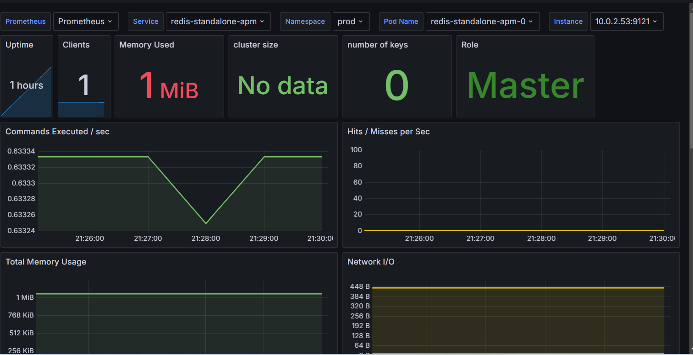

# Redis Operator Installation and Redis Pod Deployment with Node Affinity, Tolerations, and Resource Limits

1. Install the Redis operator on the same node as the Ingress controller and Prometheus to share resources:

   ```bash
   helm install redis-operator redis-operator-0.14.0.tgz -n redis-operator
2. Add toleration for tainted node by editing the Redis operator deployment:

``` bash
kubectl edit deployment redis-operator -n redis-operator
```


3. Taint the node where Redis and the exporter will run (example node: ip-10-0-2-22.us-east-2.compute.internal):

```bash
kubectl taint node ip-10-0-2-22.us-east-2.compute.internal apm=true:NoSchedule
```
4. Create a namespace prod for the Redis deployment:

``` bash
kubectl create ns prod
```
5. Create a Redis authentication secret with password apm-pass:

``` bash
kubectl create secret generic redis-secret-apm -n prod --from-literal=password=apm-pass
```
6. Deploy Redis and Redis exporter with node affinity, toleration, and resource limits by applying redis-standalone-apm.yml:

``` bash
kubectl apply -f redis-standalone-apm.yml -n prod
```


7. Apply the ServiceMonitor to scrape metrics from the Redis exporter in Prometheus by applying redis-standalone-apm-service-monitor.yml:
 ``` bash
kubectl apply -f redis-standalone-apm-service-monitor.yml -n monitoring
```



8. Repeat the previous steps for bug, crash, and survey systems, applying the taints, tolerations, node affinity, and resource limits accordingly.

9. Or create elasticache redis instances by terraform code in main.tf file then create vpc peer connection as I did in rds instances 

