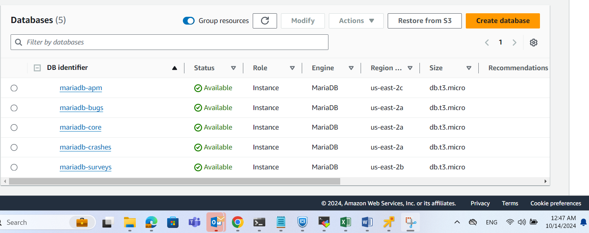
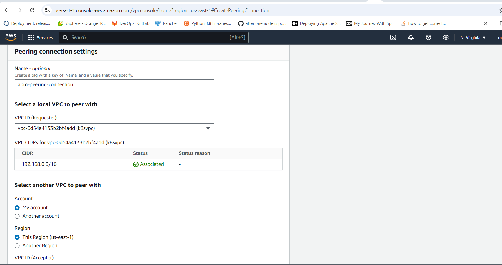
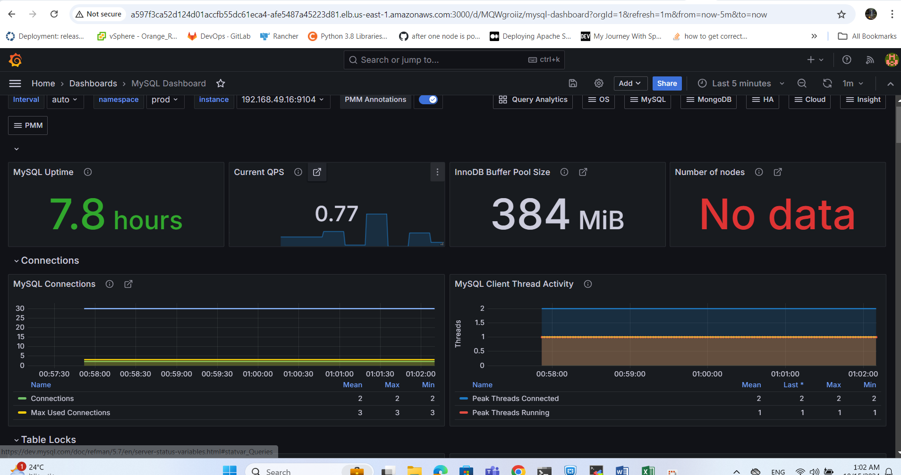

# RDS Mariadb


I create 5 RDS mariadb instances with tag product: `/apm`,`/bugs`,`/survey`,`/crashes` and `core` used for cost calculations




## Accessing Amazon RDS From AWS EKS

- create a kubernetes Service named apm-rds-service of type ExternalName aliasing the RDS endpoint
  ```bash

    kubectl apply -f rds-apm-svc.yml -n prod

-  create a **VPC Peering Connection** to facilitate communication between the resources in the two VPCs. According to the documentation





- Then Update the RDS VPC's route table by the following command:

  ```bash
  aws ec2 create-route --route-table-id rtb-099e50dae2f725b32 --destination-cidr-block 10.0.0.0/24 --vpc-peering-connection-id pcx-044d737965b8045e2


- Then  deploy mysqld-exporter and servicemonitor to scarp metrics to prometheus and display in grafana
  ```bash

   kubectl apply -f mariadb-exporter-standalone.yml -n prod

   kubectl apply -f service-monitor-mariadb.yml -n monitoring




