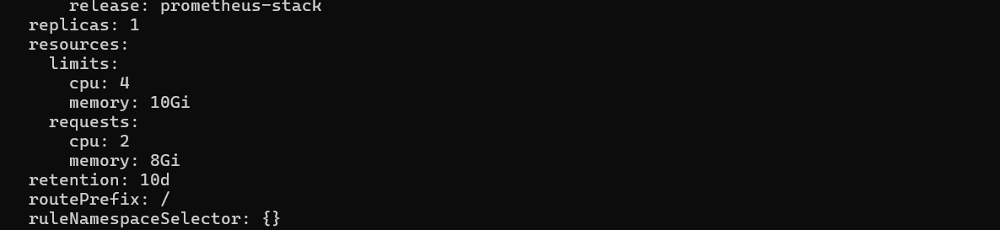

## Install Prometheus and Grafana

Follow the steps below to install Prometheus and Grafana in your EKS cluster:

1. **Create the Monitoring Namespace**:
   ```bash
   kubectl create ns monitoring

2. **Install Prometheus**:
   ```bash
   helm install prometheus-stack kube-prometheus-stack-65.2.0.tgz -n monitoring

3. **Adjust Resources for Prometheus**:
   ```bash
   kubectl edit prometheus prometheus-stack-kube-prom-prometheus -n monitoring



4. **Edit Grafana Deployment**:
   ```bash
   kubectl edit deployment prometheus-stack-grafana -n monitoring


5. **Update Admin Login Password**:
   ```bash
   kubectl patch secret prometheus-stack-grafana -n monitoring --type merge -p '{"data": {"admin-password": "MTIzNDU2"}}'

6. **Restart the Grafana Pod**:
   ```bash
   kubectl delete pod prometheus-stack-grafana -n monitoring
7. **Import Dashboards for RDS and ElastiCache**:
   
   Import dashboards for MariaDB and Redis as ConfigMaps in the Grafana directory in archived Helm charts.
